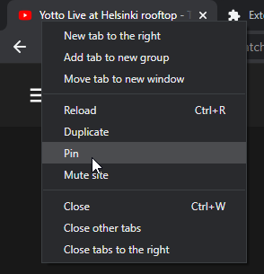
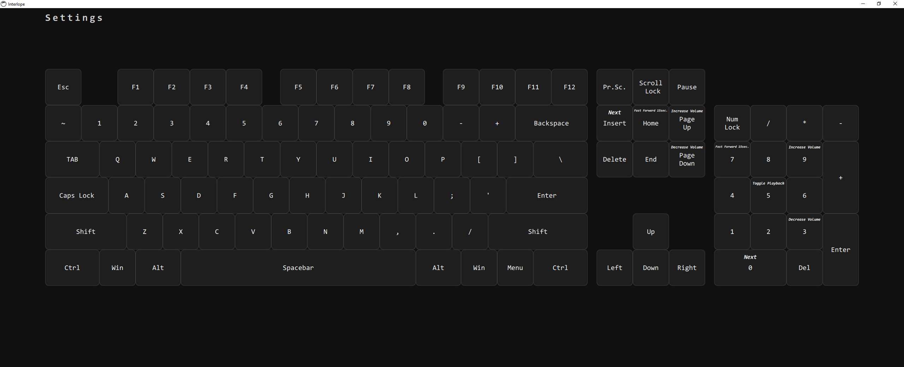
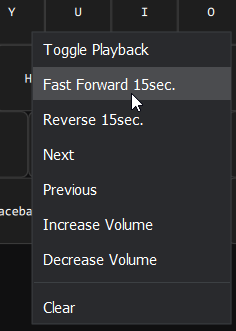
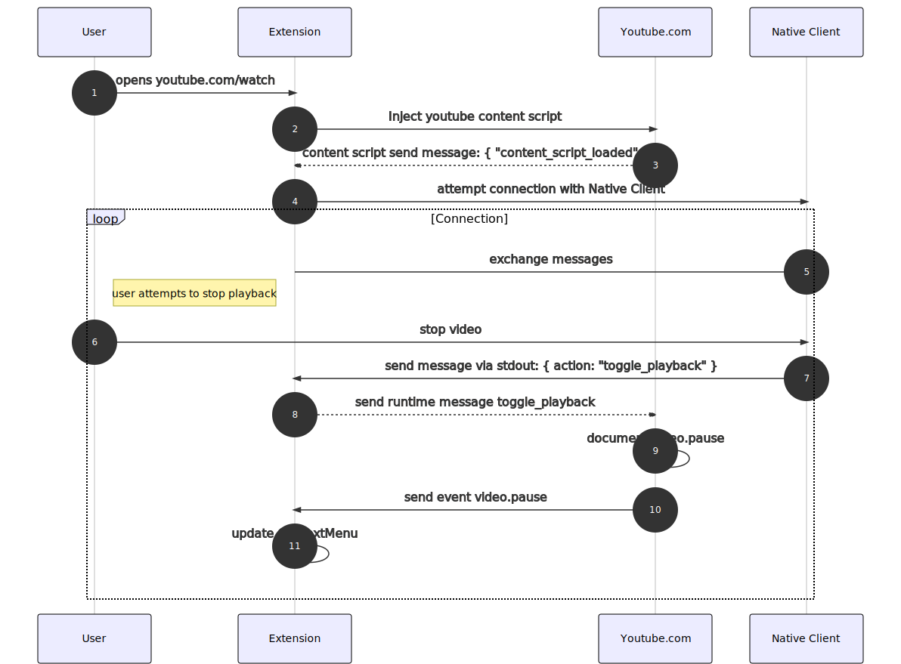

# Interlope
Desktop client and Chromium extension. Control your in-browser media stream globally with input of your choice.

  

## How to use
- Install the Interlope Client via the installer
- Install the Interlope Chromium extension
- In your browser pin a youtube/spotify tab and move it foremost left.
    
- The client launches itself upon succesful connection with pinned tab.
   
- In the client, Bind actions to the keys of your choice, i.e.:
     

## Known issues
- It is possible to have multiple instances of the client running. This will result in the later instance failling to register all the hotkeys from settings.
- Keypads / * - + keys are not getting registered. Maybe need native bindings?
- "Error: Access to the specified native messaging host is forbidden." - wrong extension id in native_messaging_manifest.json - edit it C:\Program Files\Interlope\native_messaging_manifest.json and [edit id](https://i.imgur.com/d62B8CB.png). I need to edit the extension file, todo in future when upgrading to manifest v3.
## How it works
The Interlope chromium extension controls your pinned youtube tab via a content script.

The Interlope client is a native application that registers hotkeys and send messages to the extension via Chrome Native Messaging API.

## How to build

#### Visual Studio

#### QtCreator

## FAQ
